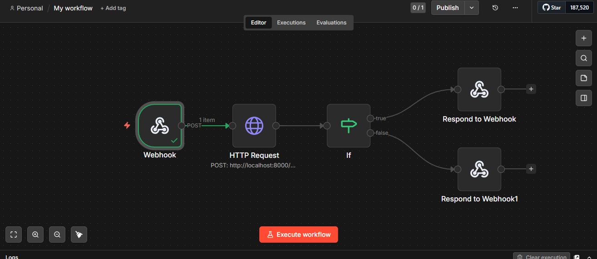

# ai-lead-qualification-pipeline
# AI Lead Qualification & CRM Pipeline

An end-to-end AI automation system that qualifies incoming leads, 
scores them with AI, saves to a CRM, and alerts the sales team on 
Slack — all within seconds of a form submission, with zero manual 
intervention.

**Live Demo:** [your-app.streamlit.app](https://your-app.streamlit.app)  
**API Docs:** [your-api.onrender.com/docs](https://your-api.onrender.com/docs)

---

## What It Does

A lead submits a form on your website. Within seconds:

1. **n8n** receives the submission via webhook
2. **AI** scores the lead 0–100 based on urgency, specificity, and business signals
3. **Airtable** stores the qualified lead with score, grade, and AI reasoning
4. **Slack** notifies the sales team immediately for HOT and WARM leads
5. **Sales rep** sees exactly who to call, why, and what action to take

Cold leads go to a nurture sequence. No human time wasted.

---

## System Architecture

```
Website Form / API Client
        │
        ▼
n8n Webhook (trigger layer)
        │
        ▼
FastAPI — AI Qualification Engine
        │
        ├── Groq LLM scores lead 0–100
        ├── Instructor enforces structured output
        └── Grade: HOT / WARM / COLD
        │
        ├──────────────────────────┐
        ▼                          ▼
Airtable CRM              Slack Notification
(every lead saved)        (HOT + WARM only)
```

---

## Lead Scoring Logic

The AI evaluates four signals:

| Signal | Max Points | Examples |
|---|---|---|
| Message clarity | 25 | Specific problem vs vague inquiry |
| Business urgency | 25 | "urgent", "this week", "losing money" |
| Company credibility | 25 | Named company, decision maker, professional email |
| Budget and scale | 25 | Team size, approved budget, volume mentioned |

**Grades:**
- 🔥 **HOT (75–100):** Contact within 1 hour
- 🌡️ **WARM (50–74):** Contact within 24 hours
- ❄️ **COLD (0–49):** Add to nurture sequence

---

## Tech Stack

| Layer | Technology | Purpose |
|---|---|---|
| Workflow Automation | n8n | Webhook trigger and node orchestration |
| AI Qualification | Groq — Llama 3.3 70B | Lead scoring and reasoning |
| Structured Output | Instructor + Pydantic | Enforces score schema from LLM |
| Backend | FastAPI | Qualification API endpoint |
| CRM | Airtable | Lead storage and management |
| Notifications | Slack Incoming Webhooks | Sales team alerts |
| Frontend Demo | Streamlit | Live demonstration interface |
| Deployment | Render (Docker) | FastAPI hosting |

---

## Key Engineering Decisions

**Why n8n in front of FastAPI?**
n8n handles the trigger, retry logic, and third-party routing without 
touching application code. FastAPI handles the intelligence. Separating 
these means you can change the workflow without redeploying the API — 
and change the AI logic without touching the workflow.

**Why Instructor for structured output?**
Raw LLM responses cannot be trusted for numeric scoring — the model 
might return a string, a range, or no score at all. Instructor enforces 
the exact schema and retries automatically if the output is invalid.

**Why not block the pipeline when Airtable fails?**
Third-party services fail. If Airtable returns an error, the lead is 
still qualified and Slack is still notified. The pipeline degrades 
gracefully — the most important actions happen regardless.

---

## Project Structure

```
ai-lead-qualification-pipeline/
├── app/
│   ├── api/
│   │   ├── routes/
│   │   │   ├── leads.py         # POST /leads/qualify endpoint
│   │   │   └── health.py        # GET /health
│   │   └── schemas.py           # Request/response Pydantic models
│   ├── core/
│   │   ├── qualifier.py         # Instructor + Groq lead scoring
│   │   └── prompts.py           # Scoring criteria system prompt
│   ├── services/
│   │   └── lead_service.py      # Airtable + Slack integrations
│   ├── config.py
│   └── main.py
├── frontend/
│   └── app.py                   # Streamlit demo interface
├── tests/
│   ├── test_qualifier.py
│   └── test_api.py
├── Dockerfile
├── docker-compose.yml
├── .env.example
├── .python-version
└── requirements.txt
```

---

## Running Locally

### Prerequisites
- Python 3.12+
- n8n installed (`npm install -g n8n`)
- [Groq](https://console.groq.com) free API key
- [Airtable](https://airtable.com) free account
- Slack workspace with incoming webhook

### Setup

```bash
git clone https://github.com/YOUR_USERNAME/ai-lead-qualification-pipeline.git
cd ai-lead-qualification-pipeline

python3 -m venv venv
source venv/bin/activate
pip install -r requirements.txt

cp .env.example .env
# Fill in GROQ_API_KEY, AIRTABLE_API_KEY, AIRTABLE_BASE_ID, SLACK_WEBHOOK_URL
```

**Start FastAPI (Terminal 1):**
```bash
uvicorn app.main:app --reload --port 8000
```

**Start n8n (Terminal 2):**
```bash
n8n start
# Open http://localhost:5678 and import the workflow
```

**Start demo frontend (Terminal 3):**
```bash
cd frontend
streamlit run app.py
```

**Test the API directly:**
```bash
curl -X POST "http://localhost:8000/api/v1/leads/qualify" \
  -H "Content-Type: application/json" \
  -H "x-webhook-secret: your-secret" \
  -d '{
    "name": "Emeka Obi",
    "email": "emeka@techcorp.ng",
    "company": "TechCorp Nigeria",
    "message": "We urgently need an AI chatbot. 500 daily queries, budget approved, want to start this week.",
    "source": "Website"
  }'
```

### With Docker
```bash
docker compose up --build
```

---

## n8n Workflow

The n8n workflow orchestrates the full pipeline. 
For local setup, import the workflow JSON below after starting n8n.

For production deployment, n8n can be self-hosted on Railway, 
DigitalOcean, or any VPS. The FastAPI qualification engine is 
deployed independently on Render and callable from any n8n instance.



---

## API Endpoints

| Method | Endpoint | Description |
|---|---|---|
| `POST` | `/api/v1/leads/qualify` | Qualify a lead with AI scoring |
| `GET` | `/health` | Health check |

**Headers required:**
```
Content-Type: application/json
x-webhook-secret: your-configured-secret
```

---

## Running Tests

```bash
python -m pytest tests/ -v
```

---

## Environment Variables

| Variable | Required | Description |
|---|---|---|
| `GROQ_API_KEY` | ✅ | Groq API key |
| `AIRTABLE_API_KEY` | ✅ | Airtable personal access token |
| `AIRTABLE_BASE_ID` | ✅ | Your Airtable base ID |
| `AIRTABLE_TABLE_NAME` | ❌ | Table name (default: Leads) |
| `SLACK_WEBHOOK_URL` | ✅ | Slack incoming webhook URL |
| `N8N_WEBHOOK_SECRET` | ✅ | Shared secret between n8n and API |
| `LLM_MODEL` | ❌ | Groq model (default: llama-3.3-70b-versatile) |
| `APP_ENV` | ❌ | Environment name |

---

## Author

**Mubarak Olalekan Oladipo**  
AI Software Engineer  
[GitHub](https://github.com/Mubrix2) · [LinkedIn](https://linkedin.com/in/mubarak-oladipo)